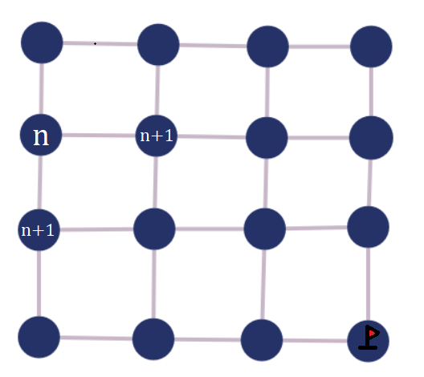

# Introdução

Este trabalho diz respeito ao projeto acadêmico realizado nas dependências da faculdade Inteli (Instituto de Tecnologia e Liderança) como parte do módulo 05 (03º semestre) da grade curricular do bacharelado em Ciência da Computação da instituição e em parceria com a empresa AEL Sistemas.

O propósito deste projeto é o desenvolvimento de um algoritmo que automatize o processo de escolha de um caminho ideal para missões aéreas militares quaisquer.

Missões aéreas são parte integrante das atividades militares em muitos países pelo mundo. Elas têm uma variedade de funções, incluindo defesa, reconhecimento e resgate. No entanto, algumas missões precisam ser realizadas em baixa altitude (entre 350 e 500 pés acima do nível da terra ou da água) e, portanto, apresentam desafios significativos que precisam ser enfrentados para garantir o sucesso e a segurança dos envolvidos.

Um dos principais desafios das missões de baixa altitude é a falta de bom reconhecimento do terreno e do relevo, o que pode aumentar em grande escala o risco de colisão ou passagem por zonas de risco, como territórios inimigos ou áreas populacionais. Esses riscos podem levar à destruição da aeronave e/ou ao acidente do piloto, resultando em perdas para a missão e para o país. Pesquisadores, como Adams, Kuang e Wang (2018), propõem soluções que utilizam análise espacial em 3D para lidar com esse problema e melhorar a segurança das missões.

 Com base nas informações fornecidas sobre o terreno da área da missão, o algoritmo montará um grafo a partir dos nós e arestas inseridos pelo usuário, atribuindo pesos às arestas com base no cálculo balanceado entre distância e altitude. Uma vez que o grafo é montado, o sistema calcula o peso total das possíveis trajetórias e escolhe a de menor peso, disponibilizando a rota mais eficiente para a equipe. 

 Tendo esse contexto em vista, foi desenvolvida uma solução para missões de baixa altitude, permitindo que a melhor rota seja escolhida entre o ponto inicial e final, balanceando a distância, altitude e características específicas da missão, como a aeronave usada, áreas de exclusão (como zonas populadas que são colocadas em risco durante as missões), entre outros fatores. Além disso, altitudes elevadas devem ser evitadas ao máximo, e não excluídas, para manter a segurança do piloto e reduzir a visibilidade da nave para possíveis inimigos. Essa solução proposta por Liu, Wang, Zhou e Yang (2021) utiliza um sistema inteligente de planejamento de missões para drones de baixa altitude, levando em consideração diversos fatores para encontrar a melhor rota.

# Trabalhos relacionados

Pela natureza do projeto, não foi possível encontrar projetos que se aplicam a situações de missões militares em baixa altitude, no entanto, foi possível encontrar algo similar em um artigo sobre "Uma Abordagem de Risco Mínimo para Planejamento de Trajeto de VANTs (Veiculos Aéreos Não Tripulados)" (DE FILIPPIS; GUGLIERI; QUAGLIOTTI, 2010). 
Muitos dos conceitos utilizados no artigo são semelhantes aos utilizados no projeto, como a utilização de um grafo para representar o terreno e a utilização de um algoritmo de busca para encontrar a melhor rota, estas semelhanças serão discutidas mais a frente.

# Motivação

Este projeto tem como finalidade o tracejamento de uma rota ideal para um piloto em operações militares, buscando priorizar sua segurança e a eficiência de sua missão.

A segurança do piloto nestes voos pode ser violada de diversas maneiras dependendo das características específicas do voo que está sendo realizado: forças opositoras, características topográficas e propriedades da nave estão entre as possíveis causas deste problema.

De acordo com dados publicamente disponibilizados por orgãos públicos, voos em baixa altura (LALT) compõem grande parte dos tipos de ocorrência (Taxonomia SIPAER) dos acidentes aéreos nos segmentos agrícolas, tendo feito parte dos fatores destaque em múltiplas edições da RASO (Relatório Anual de Segurança Operacional) da ANAC (Agência Nacional de Aviação Civil) e no Sumário Estatístico da Aviação Agrícola realizado entre 2010 e 2019 da CENIPA (Centro de Investigação e Prevenção de Acidentes Aeronáuticos).

Apesar deste trabalho estar focado em operações militares, que por sua natureza lidam com situações confidenciais e de restrito acesso, podemos inferir o risco de acidentes aéreos em baixa altitude visto que o segmento agrícola, ao contrário das outras categorias de voo, comumente adota a prática do voo em baixa altitude para realizar suas operações, e serve como um ponto de atenção aos riscos envolvidos com voos desta natureza.

Estes riscos, por sua vez, não levam em conta a presença de forças opositoras, visto que foram voos não militares realizados em território nacional. Não há dados publicamente disponíveis para corroborar este problema, mas é de senso comum inferir que naves militares em território clandestino serão tratadas como hostís e recebidas de acordo.

Um sistema de mapeamento de terreno poderia contribuir na mitigação ou eliminação destes problemas entregando ao piloto e ao time de operações mais consciência situacional do terreno em que ele se encontra; o caminho deverá, idealmente, levar vantagem do terreno para diminuir o risco de detecção visual, entregar um caminho que não se encontra com áreas ou terrenos que apresentam risco ao piloto, e instruir ao condutor para que sua elevação se mantenha ideal para a missão, mantendo a baixa altitude e sua segurança.

No assunto de eficiência, este trabalho busca tomar vantagem das capacidades matemáticas de um computador para gerar um caminho ideal agregando informações sobre o terreno e comprovando, matematicamente, qual é o melhor caminho a se seguir. Utilizando de diversos parâmetros e fórmulas que do contrário, em utilização manual ou auxiliada, se provaria mais exigente e custoso para o time de planejamento. 

Logo, as motivações deste trabalho podem ser resumidas nos quesitos de segurança e eficiência, buscando que o resultado de qualquer missão que utilize este algoritmo tenha o resultado ideal de um piloto seguro e o terreno mapeado.

# Metodologia

Como já mencionado na introdução, este projeto faz parte da grade curricular do bacharelado em Ciência da Computação do Inteli, logo, as decisões de quais métodos serão utilizados também leva em conta o aprendizado que será adquirido com a utilização das ferramentas.

Logo, é possível afirmar que este processo pode ser replicado por quaisquer outras ferramentas similares, visto que cumpram os mesmos objetivos relatados.

A linguagem de programação escolhida neste projeto foi o Java, devido a sua ampla aplicação no mercado e o repertório de conteúdo didático disponível para a linguagem. 

Dentro do Java, também é utilizado a ferramenta de gerenciamento e construção de projetos Apache Maven, que tem a finalidade de facilitar o gerenciamento de dependências, a construção, o teste e a implementação de projetos Java. Em nosso caso específico, a utilizamos para gerenciar importantes dependências para nosso projeto.

Uma dessas dependências é o GDAL (Geospacial Data Abstraction Library / Biblioteca de Abstração de Dados Geospaciais), que é uma biblioteca que permite a leitura e gravação de dados geoespaciais em vários formatos.
Em nosso caso específico, utilizamos o GDAL para ler arquivos DTED.

 Arquivos DTED (Digital Terrain Elevation Data / Dados Digitais de Elevação de Terreno) é um padrão de dados geoespaciais utilizado pelo Departamento de Defesa dos Estados Unidos para representar dados de elevação de terreno. Em nosso caso, utilizamos 4 conjuntos de dados que representam as localizações Rio de Janeiro, São Paulo, Yosemite e Vale da Morte. 
 

Estes dados são, na verdade, um conjunto de arquivos .dt2, que é um componente do formato DTED e significa a resolução espacial dos dados de elevação dos terrenos citados, no caso, a extensão .dt2 armazena a grade com a maior resolução (aproximadamente 0,25 km x 0,25 km na linha do equador).

Dependendo das necessidades do projeto, o formato DTED oferece outras 2 resoluções, sendo estas representadas por arquivos de extensão .dt0 e .dt1, sendo .dt0 o nível mais baixo de resolução (aproximadamente 1 km x 1 km na linha do equador) e .dt1 o nível intermediário (aproximadamente 0,75 km x 0,75 km na linha do equador), todas as extensões utilizam de uma grade de células, e cada célula representa uma área de 30 segundos de latitude por 30 segundos de longitude.

Outra dependência necessária é o Neo4j Driver, que realiza a conexão e a comunicação do algoritmo com o banco de dados Neo4j e permite as manipulações de CRUD (Create, Read, Update, Delete / Criar, Ler, Atualizar e Deletar) no banco.

O banco de dados Neo4j é um banco de dados de grafo, que se difere de um banco de dados regular por utilizar um modelo que consiste em nós (representando objetos ou entidades) conectados por arestas (representando relacionamentos entre esses objetos ou entidades) ao invés de tabelas e linhas, como bancos de dados relacionais tradicionais.

O Neo4j não só nos auxilia com o armazenamento das informações, que será instrumental na integração com a aplicação web, porém também irá nos auxiliar com a visualização dos dados inseridos, dando aos desenvolvedores uma maneira de imaginar como o grafo deveria ser visto.

Porém, não é ideal que o usuário interaja com o algoritmo diretamente e, para remediar este problema, utilizamos de uma solução web integrada com o banco de dados Neo4j e o algoritmo em Java.

O usuário terá acesso a uma página web (Utilizando das tecnologias HTML e CSS) conectada ao banco de dados Neo4j, onde ele irá enviar, primeiramente, os parâmetros para um MBR (Minimum Bounding Rectangle), que consiste do Ponto Superior Esquerdo e Ponto Inferior Direto(Em graus de latitude e longitude), após isto ele irá inserir o ponto inicial e o ponto final da trajetória e terá a opção de executar o algoritmo em Java com estes argumentos.

A comunicação entre a aplicação web e o algoritmo em Java é feita pelo framework Spring, outra dependência inserida em nosso arquivo pom.xml, que representa o Apache Maven.

Spring é um framework para desenvolvimento de aplicações Java que facilita o desenvolvimento de aplicações web, desktop e móveis. 
Em nosso caso, estamos utilizando o Spring Boot, que serve para enviar utilizar as informações obtidas na aplicação web para utilizar como parâmetro em nosso algoritmo de busca do melhor caminho.

O algoritmo de melhor caminho é constituido de algumas partes: primeiramente, precisamos saber qual a área de operações (delimitada por meio de entradas do usuário, posteriormente as transformando em um MBR) e baseado nela, podemos dizer se temos dados sobre o terreno especificado ou não (limitado pelos arquivos DTED em possessão; como já citado, temos acesso a coordenadas dentro de São Paulo, Rio de Janeiro, Yosemite e Vale da Morte)

Feita esta verificação, podemos atuar na criação da grade, onde cercaremos o MBR criado a partir da entrada do usuário, que será referido como área de operações, em vértices espalhados em 120m de distância máxima horizontal e vertical (Vértices relacionados pela diagonal terão uma distância de ~~ 169,71m) populando toda a área de operações e salvando estas informações em um array.

Após isto, é implementado o algoritmo A*, que é uma extensão do algoritmo de Dijkstra, este que é um algoritmo de busca em grafo que encontra o caminho mais curto entre dois pontos em um grafo com pesos positivos.

A razão pela escolha do algoritmo A* sobre o algoritmo de Dijkstra é pela sua adequação ao projeto. Enquanto o algoritmo de Dijkstra se comporta melhor com grafos menores onde os pesos são positivos e iguais, o algoritmo A* consegue lidar com grafos maiores e de pesos diferentes pela sua implementação de uma heurística.

Esta escolha entra em concordância com nossa revisão bibliográfica; "*O algoritmo A* representa um dos métodos mais amplamente utilizados para geração de caminhos, sendo aplicado a problemas de ciência robótica, exploração espacial e videogames.
Este algoritmo combina características dos algoritmos Djikstra e Bellman-Ford, porém,
foi mais especificamente desenvolvido para analisar de forma mais eficaz o domínio a fim de para evitar obstáculos distribuídos. Na presença de ameaças passivas, como cânions e
armadilhas, A* associa uma função de custo heurística combinada com uma varredura aprimorada do
domínio, aprimorando o processo de solução com mais eficiência do que os métodos Djikstra e Bellman-Ford podem fazer*" (DE FILIPPIS; GUGLIERI; QUAGLIOTTI, 2010) 

A heurística no algoritmo A* é utilizada para estimar a distância restante do nó atual ao nó de destino. Esta heurística se prova muito adequada a este projeto, visto que utilizaremos da variação de altitude entre diferentes pontos e este valor será alterado, dependendo se estamos subindo ou descendo.

Neste caso, utilizaremos como heurística a fórmula "X * distancia + Y * altura, sendo que X + Y = 1". Desta forma, podemos ponderar melhor as possíveis opções do algoritmo e obter a melhor trajetória.

Estamos, então, procurando o menor valor de peso; uma vez que quanto maior a distância/altura, menos desejável é aquela trajetória.

Quando finalizada a execução do algoritmo e encontrada a melhor trajetória, o algoritmo irá enviar armazenar este resultado no banco de dados Neo4j, que irá, por sua vez, atualizar a solução web que está conectada a ele.

Após atualizado o banco de dados, a solução web irá exibir um grafo utilizando da biblioteca D3.js, que oferece uma visualização de dados interativa e dinâmica através da web.

E estas são nossas metodologias e ferramentas utilizadas para a realização da solução. Podemos resumi-las nas seguintes camadas: 

Front-End (Web): D3.js, HTML, CSS

Back-End (Web): Spring Boot, Node.js

Banco de Dados: Neo4j

Back-End (Algoritmo): Java, Maven, GDAL

# Análise da complexidade da solução proposta

Neste artigo, cada grupo precisará fazer a análise de complexidade da solução proposta, utilizando as notações $O(.)$, $\Omega(.)$ e $\Theta(.)$.

A seguir temos a citação de alguns trechos de DASGUPTA et. al. (2011) para mostrar como estas notações são em \LaTeX. 

> Sejam $f(n)$ e $g(n)$ duas funções de inteiros positivos em reais positivos. Dizemos que $f = O(g)$ (que significa que "$f$ não cresce mais rápido do que $g$") se existe uma constante $c > 0$ tal que $f(n) \leq c \cdot g(n)$.

Ainda em outro trecho de DASGUPTA et. al. (2011), temos:

> Assim como $O(.)$ é análogo a $\leq$, podemos definir análogos de $\geq$ e $=$ como se segue:

> $f = \Omega(g)$ significa $g = O(f)$

# Análise da corretude da solução proposta

 A prova da "corretude" de um algoritmo consiste em mostrar que ele executa
corretamente o processo desejado, isto é, que chega à solução procurada Existem
métodos de prova formal da corretude, empregando Lógica Matemática. Nessa área há
duas dasses de problemas: a prova da execução correta e a prova de que a execução
termina para quaisquer dados de entrada. Esta última questão é denominada o
problema da parada. (Setzer V.W. e Carvalheiro F.H. ALGORITMO E SUA ANÁLISE
(Uma Introdução Didática); Agosto 1993) 

## **Explicando o algoritmo**

 O algoritmo A* (pronuncia-se "A estrela") tem a funcionalidade de realizar uma busca de menor custo, dado um grafo conexo, também chamado de malha. Dito isso, o algoritmo funcionaria da seguinte maneira: 

* **Primeiro passo:** Dito que o algoritmo tem o objetivo de tracejar uma rota entre dois pontos, faz-se trivial que a primeira coisa a ser feita seja o input de dois nós pelo usuário, um indicando o ponto de partida e um que indique o destino.
 

* **Segundo passo:** Dado os pontos de destino o algoritmo por meio de diferentes métodos de busca, localiza onde esses pontos se encontram em um determinado grafo, pode também ser chamada de malha, independentemente a função disso é como uma área de operações, é lá que o algoritmo vai começar a analisar o terreno que ele tem disponível a fim de encontrar uma rota que ligue os pontos de origem ao de destino.
 

* **Terceiro passo:** Com o conhecimento da malha e a localização dos pontos extremos da rota, o algoritmo comeca a fazer a sua análise. A procura de certa forma é simples, iniciando pelo nó de origem, o algoritmo analisa seus vizinhos e através da expressão $f_{score} = g_{score} + h_{score}$ ele cria uma lista e analisa sempre com prioridade os nós que possuem o menor $f_{score}$

> É importante ressaltar que dada a expressão $f_{score} = g_{score} + h_{score}$, cada variavel representa:
>
> * $g_{score} =$ O somatório de todos os pesos das arestas escolhidas partindo do nó de origem até o nó atual
>  
> 
> * $h_{score} =$ Também chamado de "Heurística", ele representa a distancia de Haversine entre o nó atual até o nó de destino
>  
>
> * $f_{score} =$ Uma estimativa do menor custo possível da rota completa indo da origem ao destino, passando pelo nó atual

* **Quarto passo:** Baseado na lista de prioridade criada, o algoritmo separa duas outras listas: umas de nós já visitados e outra de nós que ainda não foram visitados, o intúito dessa divisão é justamente impedir que o algoritmo fique dando voltas e passe por um mesmo nó mais de uma vez, visto que estamos buscando a rota de menor custo, é trivial que isso não ocorra.

* **Conclusão final:** Os passos 3 e 4 ocorrem de forma iterativa, isto é, para todo e qualquer nó $n$ a qual o procedimento é realizado, o mesmo procedimento ocorre para o nó $n+1$ enquanto $n+1 \neq$ destino. Assim que o algortimo chega ao destino, a rota está tracejada e o algoritmo retorna o caminho.

Mas nada basta toda essa explicacao se o algoritmo não for correto, com isso faremos a seguir a corretude do algoritmo

## **Condições para otimalidade: admissibilidade e consistência**

> De acordo com as ideias apresentadas em "Inteligência Artificial" por Peter Norvig:
 
 
$\quad$ A fins de atingirmos a otimalidade do algoritmo A* é trivial que a heurística $h_{score}$ seja **admissível** e **consistente**. Para que uma heurística seja admissível, faz-se necessário que ela nunca superestime o custo de atingir o objetivo. Devido ao $g_{score}$ ser o custo real para atingir um nó qualquer $n$ ao longo do caminho atual, e $f_{score} = g_{score} + h_{score}$ temos como consequência imediata que $f_{score}$ nunca irá superestimar o verdadeiro custo de uma solução ao longo do caminho atual através de $n$.
 
$\quad$ Heurísticas admissíveis são otimistas por natureza porque imaginam que o custo de resolver o problema seja menor do que realmente é. Um exemplo óbvio é a heurística representada pela distância euclidiana. A distância em linha reta é admissível porque ela sempre será o caminho mais curto entre dois pontos quaisquer, então a reta não pode ser uma superestimativa.

### **Heurística admissível**

$\quad$ No nosso caso, estamos utilizando a distância de Haversine para representar a heurística $h_{score}$, isso faz ela ser admissível e realista, entregando resultados mais próximos aos da realidade.  

>$d_{Haversine} = 2r \arcsin(\sqrt{\sin^2(\frac{y_2 - y_1}{2}) + \cos(y_1) \cdot \cos(y_2) \cdot \sin^2(\frac{x_2 - x_1}{2})})$ 

$\quad$ Apesar da menor distância entre dois pontos quaisquer ser sempre a euclidiana (linha reta), precisamos lembrar que vamos utilizar o projeto em áreas muito extensas, isso faz com que a curvatura da Terra seja um fator importante e que não possa ser relevado, por isso a distância euclidiana, por menos superestimativa que seja, continuaria sendo um problema, pois não entregaria resultados palpaveis, ao utilizá-la, inconsistencias como atravessar uma montanha como se ela não existisse seriam bem frequentes, visto que todo o relevo e a curvatura da Terra não estaria em questão. Devido isso, optamos pela fórmula de Haversine, que é a menor distância entre dois pontos que se encontram na superfície de uma esfera, passando pela superfície.  
**Obs.:** Apesar da Terra também não ser uma esfera perfeita, utilizar essa forma para os cálculos trás aproximações muito mais precisas do que imaginar como se ela fosse plana.

### **Heurística consistente**

>   O livro também diz:
>
> A segunda condição, diz mais sobre a consistência e é utilizada apenas nos casos da utilização do A* em grafos. No caso, ela diz que para todo e qualquer $h_n$, seja isso o $h_{score}$ de um nó qualquer $n$, obrigatóriamente seu valor deve ser maior que o $h_{score}$ do seu sucessor $n+1$ somado com o peso para chegar até esse nó.
> 
> 
> $h_{n} \geq h_{n+1} + \omega_{n, n+1}$

Estamos trabalhando no projeto com um grafo conexo planar, em que todos os nós estão distribuidos uniformemente, de modo que é possível formar uma área retângular ou quadrática, já que cada nó se liga apenas ao da sua direita e ao de baixo e todos estão distribuidos a uma distância de 120 m entre si.

O formato da malha seria semelhante ao seguinte exemplo:

Com o grafo definido, vamos supor alguns nós: um nó $n$ qualquer, os dois nós $n+1$, a qual são definidos por serem adjacentes ao nó $n$ e o ponto de destino, assim podemos demonstrar que a distância entre esse nó $n$ e o destino é sempre maior que a distância entre o nó $n+1$ e o destino.

Por melhor definição do problema, queremos demonstrar que indpendente de qual seja o nó $n$, sua distancia $D_n$ será sempre maior que a distancia $D_{n+1}$.

> $\forall n \mid D_n > D_{n+1}$

### **Demonstração do problema**

* Vamos primeiramente, definir 2 casos: um caso o algoritmo tome o nó $n+1$ como o de baixo e outro para se ele escolher o da direita. A partir disso vamos montar dois triângulos retângulos a fim de definir $D_n$ e $D_{n+1}$ como suas hipotenusas

* Perceba que independente da alteração de tamanho entre as hipotenusas, o cateto adjacente definido por CA é sempre constante, não importa o caso. Utilizando isso, iremos utilizar das relações fundamentais da trigonometria com fins de provar a relação entre as hipotenusas.

> Sabemos por meio da trignometria que:
>
> $\cos \theta = \frac{CA}{D_{n+1}}$ 
>  
> 
> $\cos( \theta + \alpha )= \frac{CA}{D_{n}}$
>
* Analisando a função cosseno, conseguimos perceber uma característica importante para a demonstração

Perceba que para qualquer $x$ pertencte ao intervalo $(0, \pi)$, a medida que $x$ aumenta, o valor de $\cos x$ diminui e com isso é possível concluir que quanto maior for o ângulo formado entre a hipotenusa e o cateto adjacente de um triângulo retângulo, menor será o valor do cosseno desse ângulo, visto que em um triângulo qualquer, a soma dos ângulos internos é sempre 180° ou $\pi$ em radianos

> **Demonstração de porque a soma dos ângulos internos de um triângulo é sempre 180°**
>
> * Supondo um triângulo qualquer, vamos traçar uma reta que seja tangente ao vértice oposto da base desse triângulo e seja paralela à base (formando a reta $r$) e em seguida vamos prolongar a base (formando a reta $s$), tal que, $r//s$
> 
>
> * Agora, vamos prolongar os demais lados do triângulo, de forma que teremos duas retas paralelas cortadas por duas transversais
> 
> * Como os ângulos $\hat{x}$ e $\hat{a}$ são alternos internos, podemos afirmar que $\hat{x} = \hat{a}$. Da mesma forma podemos afirmar a igualdade entre os ângulos $\hat{y}$ e $\hat{c}$. Portanto, conseguimos concluir o seguinte:
> 
> Fazendo com que $\hat{a} + \hat{b} + \hat{c} = 180°$

Dito tudo isso, podemos confirmar que $\cos(\theta + \alpha)$, que corresponde ao cosseno do triangulo cuja hipotenusa é $D_n$ é **menor** que $\cos \theta$, que corresponde ao cosseno do triangulo cuja hipotenusa é $D_{n+1}$.

Se voltarmos nas relações trigonométricas vistas anteriormente e lembrarmos que independente da variação do cosseno do ângulo e do tamanho das hipotenusas ($D_n$ e $D_{n+1}$) o valor de $CA$ é constante, é possível concluir que o valor do cosseno e o tamanho da hipotenusa são inversamente proporcionais, isto é, quanto menor for o valor do cosseno, maior será o valor da hipotenusa. Portanto, se $\cos(\theta + \alpha) < \cos \theta$, pode-se assim provar que $D_{n} > D_{n+1}$ e consequentemente levando $h_n > h_{n+1}$.

$c.q.d$

# Resultados obtidos

Com o uso do algoritmo A* integrado ao frontend, backend e Neo4j, o usuário deve inserir dados da missão, como o MBR (Minimum Bounding Rectangle), a longitude e a latitude do ponto de partida e chegada, e receberão como resultado a rota que o algoritmo considera mais eficiente. A escolha da rota leva em conta diversos fatores, mas principalmente o relevo e áreas de exclusão.

O algoritmo desenvolvido foi avaliado com sucesso usando arquivos DTED, disponibilizados pela própria AEL. Os resultados mostram que o algoritmo é capaz de escolher o caminho ideal para a missão, sendo que em algumas situações, a rota escolhida pode passar por rios devido à sua elevação nula. Isso prova que o algoritmo está funcionando conforme o esperado e selecionando caminhos que garantem a segurança do piloto, além de aumentar a eficiência da missão.

É importante destacar que a integração do algoritmo A* com as ferramentas de backend, frontend e Neo4j permite um processo rápido e preciso de seleção de rotas para missões aéreas militares. O backend e o frontend permitem que os usuários possam inserir dados da missão e receber o resultado em tempo real, enquanto o Neo4j oferece uma base de dados eficiente e precisa para armazenar as informações necessárias para a seleção da rota.

Logo, o conjunto completo aparenta ser uma solução eficiente para a seleção de rotas para missões aéreas militares e pode ser utilizada como uma ferramenta poderosa no auxílio às forças militares a planejar e executar missões aéreas com sucesso.

# Conclusão

Em conclusão, a seleção da rota é uma parte crucial do planejamento e execução de missões aéreas militares bem-sucedidas. Uma rota mal traçada pode afetar consideravelmente o sucesso da operação. Por isso, é importante selecionar uma rota eficiente que permita às forças militares evitar áreas inadequadas, de acordo com o objetivo da missão e as características da aeronave.

Nesse sentido, o algoritmo desenvolvido durante o projeto vem sendo cada vez mais utilizado, permitindo uma seleção precisa da rota com base em diversos fatores já citados anteriormente. Com a finalidade de gerar ao usuário a rota que o algoritmo identificar como mais eficiente, e consequentemente melhor.

Além disso, a tecnologia avançada de navegação e comunicação tem sido fundamental para permitir que as forças militares planejem e executem missões aéreas com precisão, garantindo que as equipes possam realizar suas tarefas com segurança. Ou seja, a tecnologia avançada consegue garantir a segurança do pessoal envolvido independente do grau de complexidade da missão.

Por fim, a seleção cuidadosa da rota é um elemento crucial para o sucesso das missões aéreas militares, e o uso de algoritmos traçadores de rotas e tecnologias avançadas de navegação e comunicação podem garantir que essas missões sejam executadas com sucesso e segurança.

# Referências Bibliográficas
//
Referenciar artigos de grafos e sua eficiência
//

Adams, C., Kuang, Y. D., & Wang, S. (2018). Routing of low-altitude flights for UAVs based on a 3D spatial analysis. Journal of Intelligent & Robotic Systems, 89(1), 139-155. doi:10.1007/s10846-017-0691-9

Liu, Y., Wang, J., Zhou, Y., & Yang, Y. (2021). An Intelligent Mission Planning System for Low-Altitude Unmanned Aerial Vehicles. Aerospace, 8(7), 196. doi:10.3390/aerospace8070196

DASGUPTA, S.; Papadimitriou, C.; Vazirani, U. **Algoritmos.** Porto Alegre: AMGH, 2011. 1 recurso online. ISBN 9788563308535. Disponível em: https://integrada.minhabiblioteca.com.br/books/9788563308535. Acesso em: 17 jan. 2023.

AGÊNCIA NACIONAL DE AVIAÇÃO CIVIL (ANAC). RASO - Relatório Anual de Segurança Operacional. [S. l.], 7 out. 2022. Disponível em: https://www.gov.br/anac/pt-br/assuntos/seguranca-operacional/informacoes-de-seguranca-operacional/relatorio-anual-de-seguranca-operacional. Acesso em: 5 mar. 2023.

CENTRO DE INVESTIGAÇÃO E PREVENÇÃO DE ACIDENTES AERONÁUTICOS (CENIPA). DADOS ESTATÍSTICOS. [S. l.], 2019. Disponível em: https://www2.fab.mil.br/cenipa/index.php/prevencao/dados-estatisticos. Acesso em: 5 mar. 2023.

OPEN SOURCE GEOSPATIAL FOUNDATION. GDAL Documentation. [S. l.], 2023. Disponível em: https://gdal.org/index.html. Acesso em: 5 mar. 2023.

NEO4J. Neo4j Graph Database. [S. l.], 2023. Disponível em: https://neo4j.com/product/neo4j-graph-database/. Acesso em: 10 mar. 2023.

VMTANZU. Spring. Why Spring?. [S. l.], 2023. Disponível em: https://spring.io/why-spring. Acesso em: 10 mar. 2023.

BOSTOCK, Mike. D3.js - Data-Driven Documents. [S. l.], 2021. Disponível em: https://d3js.org/. Acesso em: 12 mar. 2023.

DE FILIPPIS, Luca; GUGLIERI, Giorgio; QUAGLIOTTI, Fulvia. A Minimum Risk Approach for Path Planning of UAVs. Journal of Intelligent & Robotic Systems, Holanda, ano 2011, v. 61, n. 1-4, p. 203 - 219, Disponível em: https://doi.org/10.1007/s10846-010-9493-9 Acesso em: 12 mar. 2023.

RUSSEL, S.; NORVIG, P.; Artificial Inteligence: A Modern Approach.
Prentice-Hall, Second Edition, 2003. Disponível em: https://integrada.minhabiblioteca.com.br/reader/books/9788595156104/epubcfi/6/28[%3Bvnd.vst.idref%3Dch03.xhtml]!/4/2/2/402/11:219[tic%2Ca.].