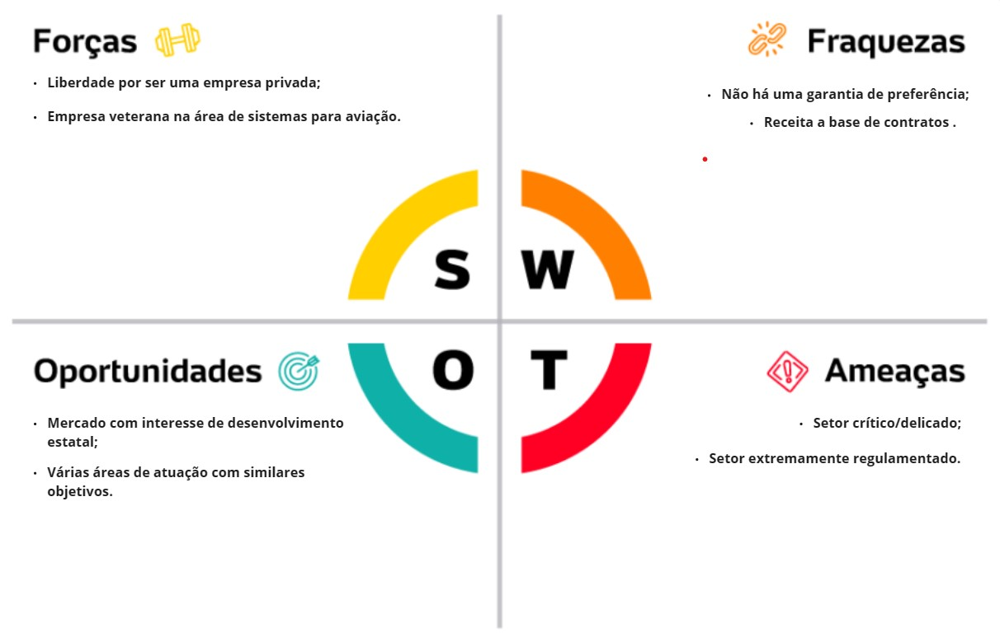
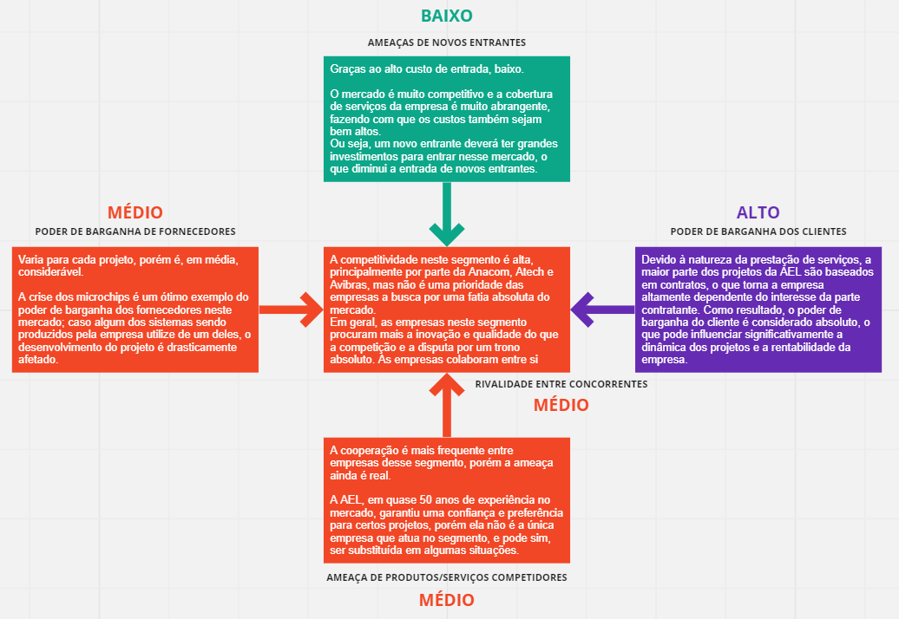
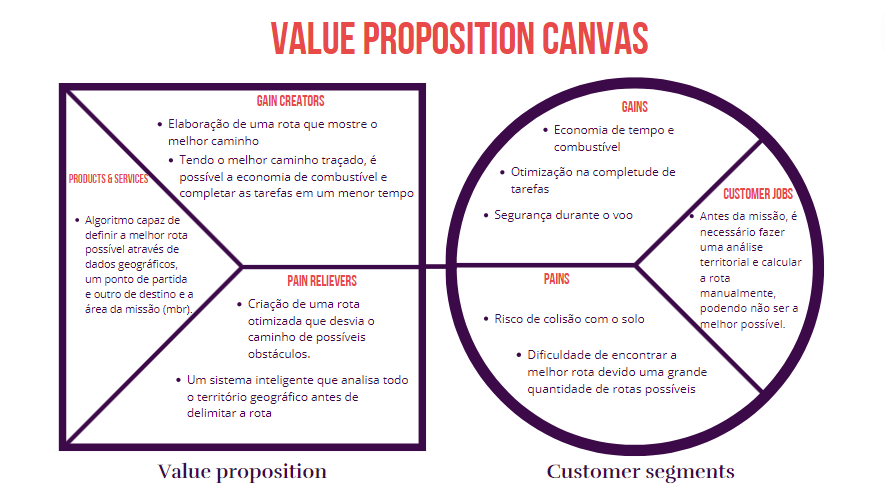
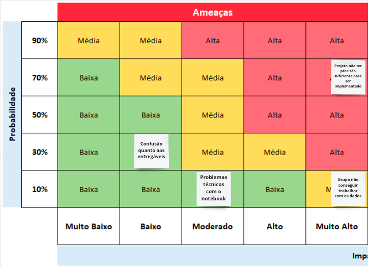
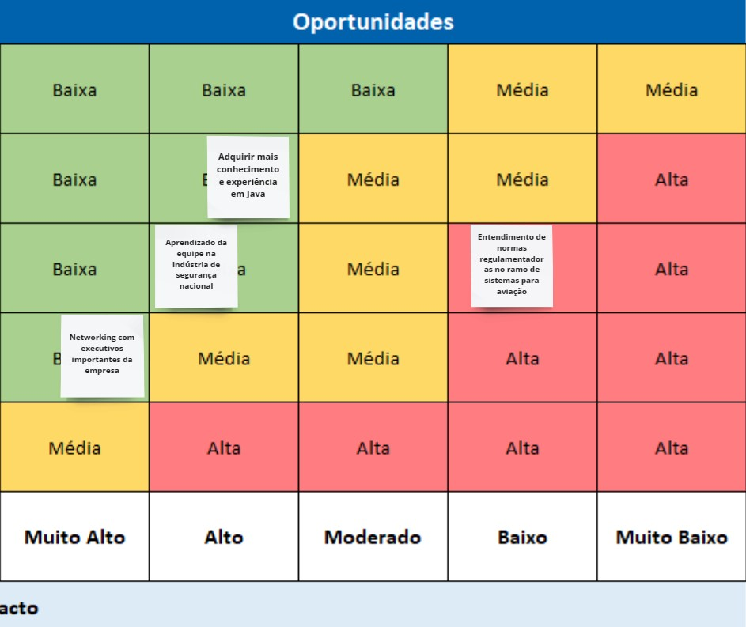
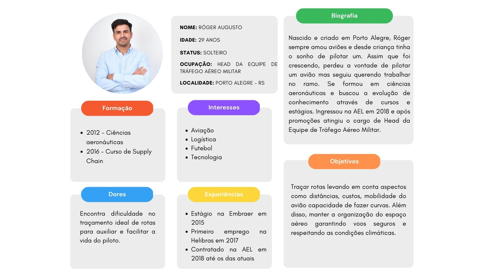
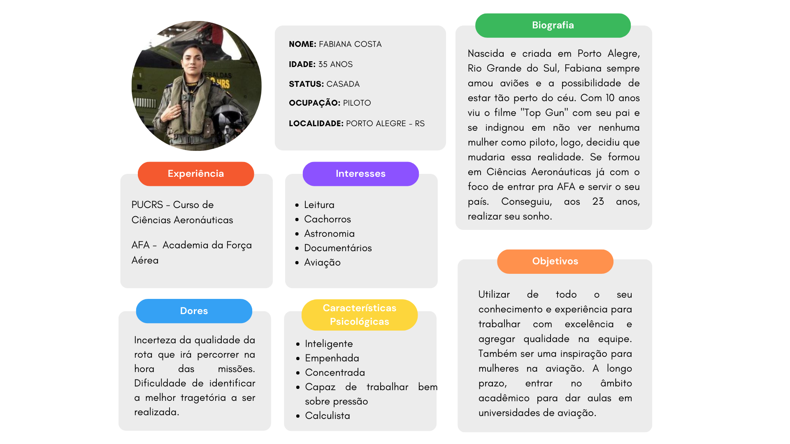
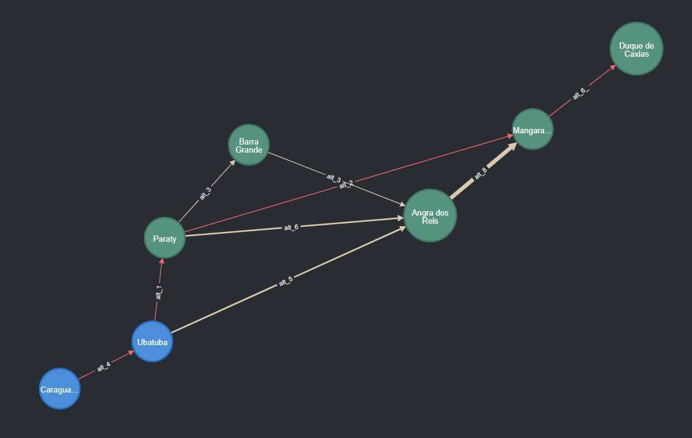

<table>
<tr>
<td>

</td>
<td>
</td>
</tr>
</table>

Planejador de trajetórias para voos em baixa altitude

- [Autores](#autores)
- [Visão Geral do Projeto](#visão-geral-do-projeto)
  - [Empresa](#empresa)
  - [O Problema](#o-problema)
    - [Contexto do problema](#contexto-do-problema)
    - [Variáveis de decisão do problema](#variáveis-de-decisão-do-problema)
    - [Limitações](#limitações)
  - [Objetivos](#objetivos)
    - [Objetivos gerais](#objetivos-gerais)
      - [Qual é o problema a ser resolvido](#qual-é-o-problema-a-ser-resolvido)
      - [Qual o objetivo da solução ?](#qual-o-objetivo-da-solução-)
    - [Objetivos específicos](#objetivos-específicos)
      - [Como a solução proposta deverá ser utilizada](#como-a-solução-proposta-deverá-ser-utilizada)
      - [Qual será o critério de sucesso e qual medida será utilizada para o avaliar](#qual-será-o-critério-de-sucesso-e-qual-medida-será-utilizada-para-o-avaliar)
  - [Partes interessadas](#partes-interessadas)
- [Análise do Problema e Solução](#análise-do-problema-e-solução)
      - [Qual a solução proposta (visão de negócios)](#qual-a-solução-proposta-visão-de-negócios)
  - [Análise do cenário: Matriz SWOT](#análise-do-cenário-matriz-swot)
  - [5 Forças de Porter](#5-forças-de-porter)
  - [Proposta de Valor: Value Proposition Canvas](#proposta-de-valor-value-proposition-canvas)
  - [Matriz de Risco](#matriz-de-risco)
      - [Ameaças:](#ameaças)
      - [Oportunidades:](#oportunidades)
- [Requisitos do Sistema](#requisitos-do-sistema)
  - [Personas](#personas)
  - [Histórias dos usuários (user stories)](#histórias-dos-usuários-user-stories)
    - [**User Stories Róger Augusto**](#user-stories-róger-augusto)
    - [**User Stories Fabiana Costa**](#user-stories-fabiana-costa)
- [Arquitetura do Sistema](#arquitetura-do-sistema)
  - [Módulos do Sistema e Visão Geral (Big Picture)](#módulos-do-sistema-e-visão-geral-big-picture)
  - [Descrição dos Subsistemas](#descrição-dos-subsistemas)
    - [Requisitos de software](#requisitos-de-software)
  - [Tecnologias Utilizadas](#tecnologias-utilizadas)
- [UX e UI Design](#ux-e-ui-design)
  - [Wireframe + Storyboard](#wireframe--storyboard)
  - [Design de Interface - Guia de Estilos](#design-de-interface---guia-de-estilos)
- [Projeto de Banco de Dados](#projeto-de-banco-de-dados)
  - [Modelagem inicial](#modelagem-inicial)
  - [Modelo Conceitual](#modelo-conceitual)
  - [Modelo Lógico](#modelo-lógico)
- [Teste de Software](#teste-de-software)
  - [Testes Unitários](#testes-unitários)
  - [Teste de Usabilidade](#teste-de-usabilidade)
- [Análise de Dados](#análise-de-dados)
  - [Visão geral](#visão-geral)
- [Manuais](#manuais)
  - [Manual de Implantação](#manual-de-implantação)
  - [Manual do Usuário](#manual-do-usuário)
  - [Manual do Administrador](#manual-do-administrador)
- [Referências](#referências)

# Autores

* Gabriel Caetano Nhoncanse
* Jonas Viana Sales
* Mateus Rafael Miranda da Silva
* Raphael Lisboa Antunes
* Sarah Ribeiro
* Sergio Brito Amorim Lucas
* Thomas Frajhof Brand

# Visão Geral do Projeto

## Empresa

A AEL Sistemas S.A., anteriormente conhecida como Aeroeletrônica e fundada em 1982, é uma empresa especializada em tecnologias de defesa, espaço e segurança pública. Com sede em Porto Alegre, a empresa é responsável pelo projeto, desenvolvimento, fabricação, suporte logístico e manutenção de sistemas eletrônicos militares e espaciais para plataformas aéreas, marítimas e terrestres e tem como missão fornecer soluções confiáveis e inovadoras para seus clientes nestes segmentos.

A empresa desde 2001 faz parte do grupo Elbit Systems, líder mundial no setor de defesa, e tem participado em projetos estratégicos das Forças Armadas Brasileiras, incluindo o Gripen NG, o KC-390, o Guarani e o Sistema Integrado de Monitoramento de Fronteiras (SISFRON). 

Também tem se destacado como pioneira na modernização de aeronaves militares da Força Aérea Brasileira, incluindo o Embraer EMB-314 Super Tucano, o AMX e o F-5EM, além de ser reconhecida por fornecer peças para veículos aéreos remotamente pilotados, sistemas terrestres, e equipamentos eletro-ópticos para aplicações navais.

Contando com mais de 300 colaboradores (incluindo mais de 100 desenvolvedores) em suas instalações de 10.000 m², a empresa produz ou repara mais de 3.000 equipamentos por ano, gerando uma receita anual de $100 milhões, metade do qual é obtida por meio de exportações. Dentre seus principais clientes nacionais, destacam-se a Embraer, a SAAB e a Helibras. 

## O Problema

### Contexto do problema
Existem missões áereas que tem a necessidade de serem feitas em baixa altitude, sejam missões defensivas, de reconhecimento, etc., por buscarem um maior sigilo e segurança.  Com isso, surgiu um obstáculo nessas missões, visto que sem um bom reconhecimento do terreno/relevo, o risco da aeronave colidir ou passar por zonas de risco, como território inimigo, são aumentados.  Tendo esse contexo em vista, surgiu a necessidade de um sistema que reconheça o terreno e auxilie o piloto e o time no traçar da rota da missão, centralizando informações de terreno, da aeronave e de possíveis obstáculos.

### Variáveis de decisão do problema
Tudo que irá compor o peso das arestas será utilizado na solução, sendo a distância entre os nós, diferença de altura e intensidade da curva.

### Limitações

<li>Áreas de exclusão, sendo:
<ul>
<li>Áreas com radares;
<li>Áreas povoadas;
<li>Áreas de patrulha;
<li>Entre outras que o usuário pode designar.
</ul>
<li>Necessidade do algoritmo de dados prévios sobre a aeronave.

## Objetivos

### Objetivos gerais

 

#### <b>Qual é o problema a ser resolvido</b>

 
 
As operações de reconhecimento realizadas por meio de aeronaves em baixa altitude apresentam diversos riscos, tais como a detecção por parte de forças inimigas e a ocorrência de colisões com o solo (CFIT) durante voos controlados. Estes riscos podem ser mitigados, se não totalmente evitados, mediante um planejamento rigoroso da trajetória de voo, levando-se em consideração fatores críticos, como o envelope de voo específico da aeronave, sua taxa de subida, sua manobrabilidade lateral, a velocidade operacional, o teto de operação e as condições geográficas da região em questão.

Entretanto, o planejamento da trajetória de voo é um desafio, pois apesar da disponibilidade de informações sobre os aspectos críticos da operação de voo, não existe atualmente um sistema que centralize todas estas informações e, a partir delas, garante matematicamente a escolha da trajetória ideal. Caso a rota escolhida não seja a mais adequada, a operação corre o risco de falhar, colocando em perigo o piloto, que pode ser abatido por forças inimigas ou sofrer uma colisão com o solo.

Assim, a questão central a ser resolvida é a de centralizar as informações e responder com a trajetória ideal a ser seguida para assegurar a segurança e o sucesso de missões de reconhecimento em baixa altitude, realizadas por meio de aeronaves em territórios desconhecidos.

 

#### <b>Qual o objetivo da solução ?</b>

 
 
A solução envisa aumentar a confiança em operações de infiltração e reconhecimento utilizando aeronaves de alta velocidade (jatos) em voo baixo, por meio de planejamento estratégico de trajetória de voo, sendo este alimentado por informações de bancos de dados diversos com informações de topografia, da aeronave, e de possíveis forças opositoras. 

O código, de maneira direta, envisona reduzir os riscos de CFIT (Colisão com o solo em voo controlado) e de abatimento por forças opositoras, respondendo a trajetória mais segura e eficiente possível, e com isso, aumentando a confiança das forças armadas brasileiras para esses tipos de missão. 

 
 
### Objetivos específicos

Desenvolver uma interface a partir de uma sequência de grafos gerada por um banco de dados de elevação, o qual foi fornecido pela empresa parceira no projeto;

 
 

#### Como a solução proposta deverá ser utilizada
 

A proposta apresentada tem como objetivo ser aplicada inicialmente pela empresa AEL, sendo esta o principal stakeholder. Após uma rigorosa curadoria e as devidas modificações, a solução será oferecida ao cliente final, o exército brasileiro.

Este processo de curadoria é fundamental para assegurar a qualidade e eficácia da proposta, pois inclui a validação rigorosa dos cálculos matemáticos utilizados, a monitoração cuidadosa da sua trajetória, testes em condições reais de utilização, os aprimoramentos necessários e, finalmente, a integração com serviços já existentes.

#### Qual será o critério de sucesso e qual medida será utilizada para o avaliar
 
Devido à natureza da solução, não é possível testá-la em uma situação real. No entanto, há maneiras de avaliar seu sucesso, como uma análise de complexidade e corretude do algoritmo proposto, que cobre a parte matemática da solução, e uma visualização da trajetória no contexto do mapa utilizado. Estas medidas permitirão verificar a eficiência e a precisão do algoritmo proposto."

 

## Partes interessadas

<li>AEL Sistemas;
<li>Instituto de Tecnologia e Liderança (INTELI);
<li>Alunos/autores do projeto.

 
 
# Análise do Problema e Solução

 
 
#### Qual a solução proposta (visão de negócios)

O sistema em questão é projetado para auxiliar um piloto na decisão da melhor rota a seguir em territórios desconhecidos. Ao receber informações sobre o local, o sistema utiliza uma avaliação ponderada dos diferentes trajetos para determinar a trajetória ótima para chegar do ponto de origem ao ponto de destino. Este sistema oferece uma vantagem significativa em relação à segurança de operações de infiltração e reconhecimento, pois permite ao piloto entrar em um território estranho sem se preocupar com a escolha da melhor rota a seguir.

A solução proposta, sob uma perspectiva empresarial, será avaliada de forma única, como previamente detalhado. No entanto, a solução em questão, descrita neste documento, não será oferecida diretamente ao consumidor final, sendo neste caso, o exército brasileiro, mas sim à empresa AEL, que, nesta relação, atuará como curadora antes que a solução final alcance o cliente.

## Análise do cenário: Matriz SWOT

 A meta da análise SWOT é facilitar na identificação de características que ajudem o desenvolvimento do projeto. Assim, ela pode potencializar suas forças, mitigar suas fraquezas e minimizar erros, procurar oportunidades para melhorar seus produtos ou criar novos e se manter alerta às ameaças.
 

Fonte: Site da AEL

## 5 Forças de Porter

A análise das 5 forças de Porter é uma ferramenta que ajuda a identificar as forças competitivas que afetam o setor de atuação de uma empresa. 
 
Ela aborda 5 tópicos: ameaças de novos entrantes, poder de barganha dos clientes, poder de barganha dos fornecedores, ameaças de produtos ou serviços substitutos e a rivalidade entre os concorrentes, sendo que cada um destes tópicos é avaliado em 3 níveis: baixo, médio e alto, representados pelas cores verde, laranja e roxo, respectivamente.
 

## Proposta de Valor: Value Proposition Canvas

Analisando a proposta de valor, é possível identificar facilmente quais foram as dores trazidas pela empresa parceira e, analisando cada aspecto, quais foram os pontos que o grupo identificou para sanar essa dor. O conteúdo apresentado a seguir, foi apresentado e validado com os parceiros de projeto, para norteamento do grupo ao iniciar o desenvolvimento do algoritmo a partir da validação.

## Matriz de Risco

 O principal objetivo da matriz de risco e oportunidades é a clareza oferecida ao grupo em relação à eventuais problemas que possam ocorrer ao decorrer do desenvolvimento do projeto, possibilitando ao grupo a possibilidade de se previnir dos riscos e buscar as melhores oportunidades.
 
 #### Ameaças:
 

 #### Oportunidades:
 

# Requisitos do Sistema

*Descrição_dos_requisitos*

## Personas

 
 

## Histórias dos usuários (user stories)

As user stories serão o norte do grupo para o desenvolvimento do algoritmo, uma vez que será a base de informações do público que queremos atingir através da solução. Tendo isto em vista, o grupo entendeu que deveria escalar as user stories da nossa persona em 5 tópicos, que serão apresentados a seguir:

### **User Stories Róger Augusto**
<li>Eu, como Head da Equipe de Tráfego Aéreo Militar, quero o algoritmo proposto, para me auxiliar no traçamento de rotas mais eficazes.

<li>Eu, como Head da Equipe de Tráfego Aéreo Militar, quero saber os possíveis obstáculos na trajetória, para garantir a segurança do piloto e da aeronave levando em conta aspectos naturais, como relevo e clima.

<li>Eu, como Head da Equipe de Tráfego Aéreo Militar, quero integrar os dados da aeronave, para saber quando alterar o percurso e os recursos necessários para isso.

<li>Eu, como Head da Equipe de Tráfego Aéreo Militar, quero adicionar áreas de exclusão, para que a trajetória não considere esse caminho.

<li>Eu, como Head da Equipe de Tráfego Aéreo Militar, quero analisar a trajetória para poder discutir sobre os riscos e ganhos dessa missão.
 
 

### **User Stories Fabiana Costa**
  
<li>Eu, como piloto, quero percorrer a rota tracejada para evitar colisões.

<li>Eu, como piloto, quero entrar em território inimigo para garantir a segurança nacional.

<li>Eu, como piloto, quero ter acesso à rota mais otimizada possível para conseguir completar minha tarefa de uma forma mais otimizada.

<li>Eu, como piloto, quero ter acesso à rota mais otimizada possível para que eu consiga entrar em território inimigo por meio de voos a baixa altitude e garanta a segurança nacional, sem que haja gasto a toa de combustível e tempo.
 
 

# Arquitetura do Sistema

## Módulos do Sistema e Visão Geral (Big Picture)

## Descrição dos Subsistemas

### Requisitos de software

## Tecnologias Utilizadas

# UX e UI Design

## Wireframe + Storyboard

## Design de Interface - Guia de Estilos

# Projeto de Banco de Dados

## Modelagem inicial

<li>No modelo inicial da modelagem dos dados, temos um grafo composto por cidades de São Paulo (Nós em azul) e do Rio de Janeiro (Nós verdes). As arestas representam caminhos que podem ser feitos e, as ligações em vermelho, representam o melhor caminho possível, considerando os pesos das arestas, os quais são calculados pela diferença de altitude entre um nó e outro.

## Modelo Conceitual

## Modelo Lógico

# Teste de Software

## Testes Unitários

## Teste de Usabilidade

# Análise de Dados

## Visão geral
  Atualmente, temos 4 arquivos contendo dados em formato .dt2, os quais, tendo em vista o que foi explorado até o momento, são compostos por longitude, latitude e relevo. Dentre os arquivos, estão listados:
  <li>DeathValley
  <ul>
  <li>W117_N35.dt2
  <li>W117_N36.dt2
  <li>W118_N35.dt2
  <li>W118_N36.dt2
  </ul>
  <li>Rio
  <ul>
  <li>W043_S23.dt2
  <li>W043_S24.dt2
  <li>W044_S23.dt2
  <li>W044_S24.dt2
  </ul>
  <li>SaoPaulo
  <ul>
  <li>W045_S23.dt2
  <li>W045_S24.dt2
  <li>W046_S23.dt2
  <li>W046_S24.dt2
  <li>W047_S23.dt2
  <li>W047_S24.dt2
  </ul>
  <li>Yosemite
  <ul>
  <li>W119_N37.dt2
  <li>W119_N38.dt2
  <li>W120_N37.dt2
  <li>W120_N38.dt2
  <li>W121_N37.dt2
  <li>W121_N38.dt2
  </ul>

# Manuais

## Manual de Implantação

## Manual do Usuário

## Manual do Administrador

# Referências
