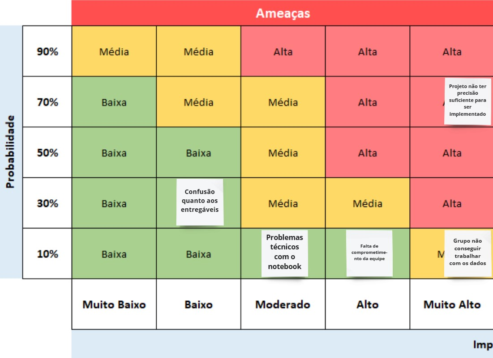

<table>
<tr>
<td>

</td>
<td>
</td>
</tr>
</table>

Planejador de trajetórias para voos em baixa altitude

- [Autores](#autores)
- [Visão Geral do Projeto](#visão-geral-do-projeto)
  - [Empresa](#empresa)
  - [O Problema](#o-problema)
    - [Contexto do problema](#contexto-do-problema)
    - [Variáveis de decisão do problema](#variáveis-de-decisão-do-problema)
    - [Limitações](#limitações)
  - [Objetivos](#objetivos)
    - [Objetivos gerais](#objetivos-gerais)
    - [Objetivos específicos](#objetivos-específicos)
  - [Partes interessadas](#partes-interessadas)
- [Análise do Problema](#análise-do-problema)
  - [Análise da área de atuação](#análise-da-área-de-atuação)
  - [Análise do cenário: Matriz SWOT](#análise-do-cenário-matriz-swot)
  - [Proposta de Valor: Value Proposition Canvas](#proposta-de-valor-value-proposition-canvas)
  - [Matriz de Risco](#matriz-de-risco)
      - [Ameaças:](#ameaças)
      - [Oportunidades:](#oportunidades)
- [Requisitos do Sistema](#requisitos-do-sistema)
  - [Personas](#personas)
  - [Histórias dos usuários (user stories)](#histórias-dos-usuários-user-stories)
- [Arquitetura do Sistema](#arquitetura-do-sistema)
  - [Módulos do Sistema e Visão Geral (Big Picture)](#módulos-do-sistema-e-visão-geral-big-picture)
  - [Descrição dos Subsistemas](#descrição-dos-subsistemas)
    - [Requisitos de software](#requisitos-de-software)
  - [Tecnologias Utilizadas](#tecnologias-utilizadas)
- [UX e UI Design](#ux-e-ui-design)
  - [Wireframe + Storyboard](#wireframe--storyboard)
  - [Design de Interface - Guia de Estilos](#design-de-interface---guia-de-estilos)
- [Projeto de Banco de Dados](#projeto-de-banco-de-dados)
  - [Modelagem inicial](#modelagem-inicial)
  - [Modelo Conceitual](#modelo-conceitual)
  - [Modelo Lógico](#modelo-lógico)
- [Teste de Software](#teste-de-software)
  - [Testes Unitários](#testes-unitários)
  - [Teste de Usabilidade](#teste-de-usabilidade)
- [Análise de Dados](#análise-de-dados)
  - [Visão geral](#visão-geral)
- [Manuais](#manuais)
  - [Manual de Implantação](#manual-de-implantação)
  - [Manual do Usuário](#manual-do-usuário)
  - [Manual do Administrador](#manual-do-administrador)
- [Referências](#referências)

# Autores

* Gabriel Caetano Nhoncanse
* Jonas Viana Sales
* Mateus Rafael Miranda da Silva
* Raphael Lisboa Antunes
* Sarah Ribeiro
* Sergio Brito Amorim Lucas
* Thomas Frajhof Brand

# Visão Geral do Projeto

## Empresa

A AEL Sistemas é uma empresa brasileira nos seguimentos Aeroespacial, Defesa e Segurança. É baseada na prestação de serviços de tecnologia da informação, incluindo consultoria, projeto, fabricação, implantação e suporte logístico de sistemas eletrônicos militares e espaciais, para aplicações em plataformas aéreas, marítimas e terrestres. Faz parte do grupo Elbit Systems e, também, atua em projetos estratégicos das Forças Armadas Brasileiras como Gripen NG, KC-390, Guarani e SISFRON - Sistema Integrado de Monitoramento de Fronteiras. É pioneira na modernização de várias aeronaves da FAB, Embraer EMB-314 Super Tucano, AMX, F-5EM que leva também o suprimento de peças.

## O Problema

### Contexto do problema
Existem missões áereas que tem a necessidade de serem feitas em baixa altitude, sejam missões defensivas, de reconhecimento, etc., por buscarem um maior sigilo e segurança.  Com isso, surgiu um obstáculo nessas missões, visto que sem um bom reconhecimento do terreno/relevo, o risco da aeronave colidir ou passar por zonas de risco, como território inimigo, são aumentados.  Tendo esse contexo em vista, surgiu a necessidade de um sistema que reconheça o terreno e auxilie o piloto e o time no traçar da rota da missão, centralizando informações de terreno, da aeronave e de possíveis obstáculos.

### Variáveis de decisão do problema
Tudo que irá compor o peso das arestas será utilizado na solução, sendo a distância entre os nós, diferença de altura e intensidade da curva.

### Limitações

<li>Áreas de exclusão, sendo:
<ul>
<li>Áreas com radares;
<li>Áreas povoadas;
<li>Áreas de patrulha;
<li>Entre outras que o usuário pode designar.
</ul>
<li>Necessidade do algoritmo de dados prévios sobre a aeronave.

## Objetivos

### Objetivos gerais

<b> Qual o objetivo da solução ? </b>

A solução envisa aumentar a confiança em operações de infiltração e reconhecimento utilizando aeronaves de alta velocidade (jatos) em voo baixo, por meio de planejamento estratégico de trajetória de voo, sendo este alimentado por informações de bancos de dados diversos com informações de topografia, da aeronave, e de possíveis forças opositoras. 

O código, de maneira direta, envisona reduzir os riscos de CFIT (Colisão com o solo em voo controlado) e de abatimento por forças opositoras, respondendo a trajetória mais segura e eficiente possível, e com isso, aumentando a confiança das forças armadas brasileiras para esses tipos de missão. 

### Objetivos específicos

*Desenvolver uma interface a partir de uma sequência de grafos gerada por um banco de dados de elevação, o qual foi fornecido pela empresa parceira no projeto;*

## Partes interessadas

*AEL Sistemas;*
*Instituto de Tecnologia e Liderança (INTELI);*
*Alunos/autores do projeto.*

# Análise do Problema

*Descrição_da_análise_do_problema*

## Análise da área de atuação

*Descrição_da_análise_da_área_de_atuação*

## Análise do cenário: Matriz SWOT

 A meta da análise SWOT é facilitar na identificação de características que ajudem o desenvolvimento do projeto. Assim, ela pode potencializar suas forças, mitigar suas fraquezas e minimizar erros, procurar oportunidades para melhorar seus produtos ou criar novos e se manter alerta às ameaças.
 

## Proposta de Valor: Value Proposition Canvas

Analisando a proposta de valor, é possível identificar facilmente quais foram as dores trazidas pela empresa parceira e, analisando cada aspecto, quais foram os pontos que o grupo identificou para sanar essa dor. O conteúdo apresentado a seguir, foi apresentado e validado com os parceiros de projeto, para norteamento do grupo ao iniciar o desenvolvimento do algoritmo a partir da validação.

## Matriz de Risco

 O principal objetivo da matriz de risco e oportunidades é a clareza oferecida ao grupo em relação à eventuais problemas que possam ocorrer ao decorrer do desenvolvimento do projeto, possibilitando ao grupo a possibilidade de se previnir dos riscos e buscar as melhores oportunidades.
 
 #### Ameaças:
 

 #### Oportunidades:
 

# Requisitos do Sistema

*Descrição_dos_requisitos*

## Personas

*Descrição_das_personas*

## Histórias dos usuários (user stories)

As user stories serão o norte do grupo para o desenvolvimento do algoritmo, uma vez que será a base de informações do público que queremos atingir através da solução. Tendo isto em vista, o grupo entendeu que deveria escalar as user stories da nossa persona em 5 tópicos, que serão apresentados a seguir:

  **User Stories Roger Augusto**
*Eu, como Head da Equipe de Tráfego Aéreo Militar, quero o algoritmo proposto, para me auxiliar no traçamento de rotas mais eficazes.*

*Eu, como Head da Equipe de Tráfego Aéreo Militar, quero saber os possíveis obstáculos na trajetória, para garantir a segurança do piloto e da aeronave levando em conta aspectos naturais, como relevo e clima.*

*Eu, como Head da Equipe de Tráfego Aéreo Militar, quero integrar os dados da aeronave, para saber quando alterar o percurso e os recursos necessários para isso.*

*Eu, como Head da Equipe de Tráfego Aéreo Militar, quero adicionar áreas de exclusão, para que a trajetória não considere esse caminho.*

*Eu, como Head da Equipe de Tráfego Aéreo Militar, quero analisar a trajetória para poder discutir sobre os riscos e ganhos dessa missão.*

# Arquitetura do Sistema

## Módulos do Sistema e Visão Geral (Big Picture)

## Descrição dos Subsistemas

### Requisitos de software

## Tecnologias Utilizadas

# UX e UI Design

## Wireframe + Storyboard

## Design de Interface - Guia de Estilos

# Projeto de Banco de Dados

## Modelagem inicial

<li>No modelo inicial da modelagem dos dados, temos um grafo composto por cidades de São Paulo (Nós em azul) e do Rio de Janeiro (Nós verdes). As arestas representam caminhos que podem ser feitos e, as ligações em vermelho, representam o melhor caminho possível, considerando os pesos das arestas, os quais são calculados pela diferença de altitude entre um nó e outro.

## Modelo Conceitual

## Modelo Lógico

# Teste de Software

## Testes Unitários

## Teste de Usabilidade

# Análise de Dados

## Visão geral
  Atualmente, temos 4 arquivos contendo dados em formato .dt2, os quais, tendo em vista o que foi explorado até o momento, são compostos por longitude, latitude e relevo. Dentre os arquivos, estão listados:
  <li>DeathValley
  <ul>
  <li>W117_N35.dt2
  <li>W117_N36.dt2
  <li>W118_N35.dt2
  <li>W118_N36.dt2
  </ul>
  <li>Rio
  <ul>
  <li>W043_S23.dt2
  <li>W043_S24.dt2
  <li>W044_S23.dt2
  <li>W044_S24.dt2
  </ul>
  <li>SaoPaulo
  <ul>
  <li>W045_S23.dt2
  <li>W045_S24.dt2
  <li>W046_S23.dt2
  <li>W046_S24.dt2
  <li>W047_S23.dt2
  <li>W047_S24.dt2
  </ul>
  <li>Yosemite
  <ul>
  <li>W119_N37.dt2
  <li>W119_N38.dt2
  <li>W120_N37.dt2
  <li>W120_N38.dt2
  <li>W121_N37.dt2
  <li>W121_N38.dt2
  </ul>

# Manuais

## Manual de Implantação

## Manual do Usuário

## Manual do Administrador

# Referências
