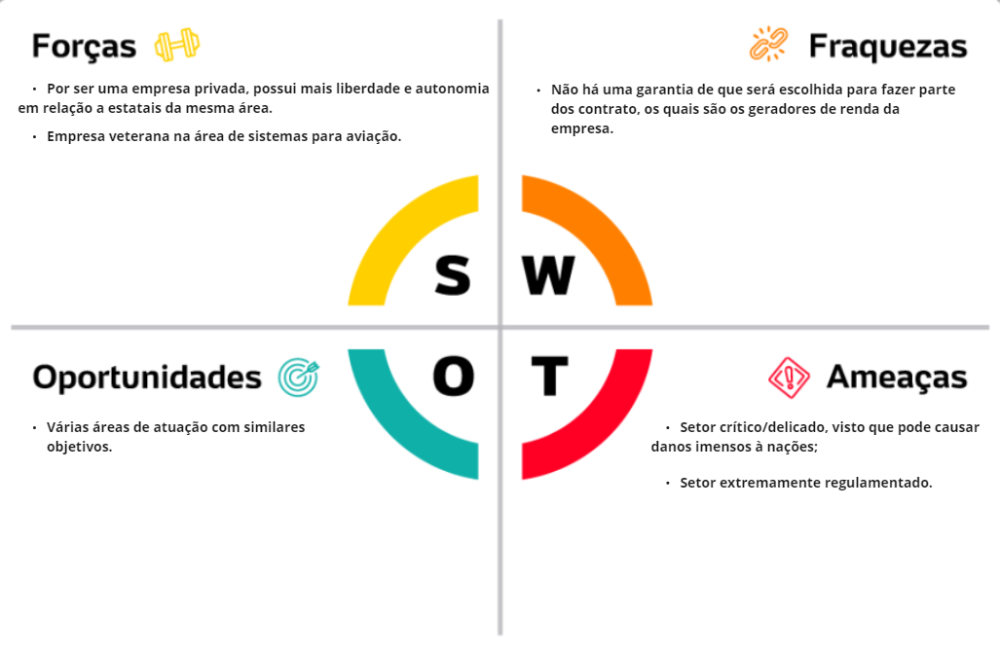
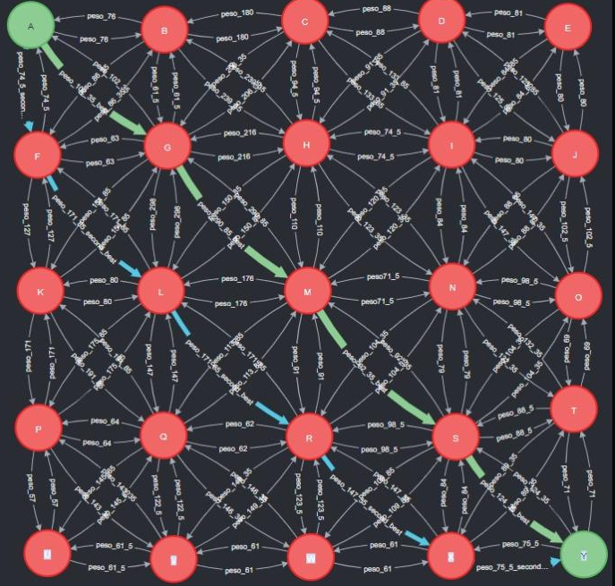

<table>
<tr>
<td>

</td>
<td>
</td>
</tr>
</table>

Planejador de trajetórias para voos em baixa altitude

- [Autores](#autores)
- [Visão Geral do Projeto](#visão-geral-do-projeto)
  - [Empresa](#empresa)
  - [O Problema](#o-problema)
    - [Contexto do problema](#contexto-do-problema)
    - [Variáveis de decisão do problema](#variáveis-de-decisão-do-problema)
    - [Limitações](#limitações)
    - [Objetivos específicos](#objetivos-específicos)
  - [Partes interessadas](#partes-interessadas)
- [Análise do Problema e Solução](#análise-do-problema-e-solução)
  - [Solução proposta](#solução-proposta)
  - [Análise do cenário: Matriz SWOT](#análise-do-cenário-matriz-swot)
  - [5 Forças de Porter](#5-forças-de-porter)
  - [Proposta de Valor: Value Proposition Canvas](#proposta-de-valor-value-proposition-canvas)
  - [Matriz de Risco](#matriz-de-risco)
    - [Ameaças](#ameaças)
    - [Oportunidades](#oportunidades)
- [Requisitos do Sistema](#requisitos-do-sistema)
  - [Personas](#personas)
  - [Histórias dos usuários (user stories)](#histórias-dos-usuários-user-stories)
    - [**User Stories Róger Augusto**](#user-stories-róger-augusto)
    - [**User Stories Fabiana Costa**](#user-stories-fabiana-costa)
- [Projeto de Banco de Dados](#projeto-de-banco-de-dados)
  - [Modelagem inicial](#modelagem-inicial)
    - [Modelagem Matemática do Problema](#modelagem-matemática-do-problema)
      - [Tomada de Decisão - Variáveis de Decisão](#tomada-de-decisão---variáveis-de-decisão)
      - [Objetivo - Função Objetivo](#objetivo---função-objetivo)
      - [Restrições - Limitações](#restrições---limitações)
- [Análise de Dados](#análise-de-dados)
  - [Visão geral](#visão-geral)
- [Sistema](#sistema)
  - [Arquitetura da Solução](#arquitetura-da-solução)
- [Referências](#referências)

# Autores

* Gabriel Caetano Nhoncanse
* Jonas Viana Sales
* Mateus Rafael Miranda da Silva
* Raphael Lisboa Antunes
* Sarah Ribeiro
* Sergio Brito Amorim Lucas
* Thomas Frajhof Brand

# Visão Geral do Projeto

## Empresa

A AEL Sistemas S.A., anteriormente conhecida como Aeroeletrônica e fundada em 1982, é uma empresa especializada em tecnologias de defesa, espaço e segurança pública. Com sede em Porto Alegre, a empresa é responsável pelo projeto, desenvolvimento, fabricação, suporte logístico e manutenção de sistemas eletrônicos militares e espaciais para plataformas aéreas, marítimas e terrestres e tem como missão fornecer soluções confiáveis e inovadoras para seus clientes nestes segmentos.

A empresa desde 2001 faz parte do grupo Elbit Systems, líder mundial no setor de defesa, e tem participado em projetos estratégicos das Forças Armadas Brasileiras, incluindo o Gripen NG, o KC-390, o Guarani e o Sistema Integrado de Monitoramento de Fronteiras (SISFRON). 

Também tem se destacado como pioneira na modernização de aeronaves militares da Força Aérea Brasileira, incluindo o Embraer EMB-314 Super Tucano, o AMX e o F-5EM, além de ser reconhecida por fornecer peças para veículos aéreos remotamente pilotados, sistemas terrestres, e equipamentos eletro-ópticos para aplicações navais.

Contando com mais de 300 colaboradores (incluindo mais de 100 desenvolvedores) em suas instalações de 10.000 m², a empresa produz ou repara mais de 3.000 equipamentos por ano, gerando uma receita anual de $100 milhões, metade do qual é obtida por meio de exportações. Dentre seus principais clientes nacionais, destacam-se a Embraer, a SAAB e a Helibras, enquanto seus principais concorrentes são AIAB e Aeroplace, ambas empresas de fabricação de componentes de aviação e aeroespaciais.

## O Problema

### Contexto do problema
Existem missões áereas que tem a necessidade de serem feitas em baixa altitude, sejam missões defensivas, de reconhecimento, etc., por buscarem um maior sigilo e segurança.  Com isso, surgiu um obstáculo nessas missões, visto que sem um bom reconhecimento do terreno/relevo, o risco da aeronave colidir ou passar por zonas de risco, como território inimigo, são aumentados.  Tendo esse contexo em vista, surgiu a necessidade de um sistema que reconheça o terreno e auxilie o piloto e o time no traçar da rota da missão, centralizando informações de terreno, da aeronave e de possíveis obstáculos.

### Variáveis de decisão do problema
Tudo que irá compor o peso das arestas será utilizado na solução, sendo a distância entre os nós, diferença de altura e intensidade da curva.

### Limitações

<li>Áreas de exclusão, sendo:
<ul>
<li>Áreas com radares;
<li>Áreas povoadas;
<li>Áreas de patrulha;
<li>Entre outras que o usuário pode designar.
</ul>
<li>Necessidade do algoritmo de dados prévios sobre a aeronave.

 

<b>Qual é o problema a ser resolvido</b>

 
 
As operações de reconhecimento realizadas por meio de aeronaves em baixa altitude apresentam diversos riscos, tais como a detecção por parte de forças inimigas e a ocorrência de colisões com o solo (CFIT) durante voos controlados. Estes riscos podem ser mitigados, se não totalmente evitados, mediante um planejamento rigoroso da trajetória de voo, levando-se em consideração fatores críticos, como o envelope de voo específico da aeronave, sua taxa de subida, sua manobrabilidade lateral, a velocidade operacional, o teto de operação e as condições geográficas da região em questão.

Entretanto, o planejamento da trajetória de voo é um desafio, pois apesar da disponibilidade de informações sobre os aspectos críticos da operação de voo, não existe atualmente um sistema que centralize todas estas informações e, a partir delas, garante matematicamente a escolha da trajetória ideal. Caso a rota escolhida não seja a mais adequada, a operação corre o risco de falhar, colocando em perigo o piloto, que pode ser abatido por forças inimigas ou sofrer uma colisão com o solo.

Assim, a questão central a ser resolvida é a de centralizar as informações e responder com a trajetória ideal a ser seguida para assegurar a segurança e o sucesso de missões de reconhecimento em baixa altitude, realizadas por meio de aeronaves em territórios desconhecidos.

 

<b>Qual o objetivo da solução ?</b>

 
 
A solução envisa aumentar a confiança em operações de infiltração e reconhecimento utilizando aeronaves de alta velocidade (jatos) em voo baixo, por meio de planejamento estratégico de trajetória de voo, sendo este alimentado por informações de bancos de dados diversos com informações de topografia, da aeronave, e de possíveis forças opositoras. 

O código, de maneira direta, envisona reduzir os riscos de CFIT (Colisão com o solo em voo controlado) e de abatimento por forças opositoras, respondendo a trajetória mais segura e eficiente possível, e com isso, aumentando a confiança das forças armadas brasileiras para esses tipos de missão. 

 
 
### Objetivos específicos

Desenvolver uma interface a partir de uma sequência de grafos gerada por um banco de dados de elevação, o qual foi fornecido pela empresa parceira no projeto;

 
 

<b>Como a solução proposta deverá ser utilizada </b>

 

A proposta apresentada tem como objetivo ser aplicada inicialmente pela empresa AEL, sendo esta o principal stakeholder. Após uma rigorosa curadoria e as devidas modificações, a solução será oferecida ao cliente final, o exército brasileiro.

Este processo de curadoria é fundamental para assegurar a qualidade e eficácia da proposta, pois inclui a validação rigorosa dos cálculos matemáticos utilizados, a monitoração cuidadosa da sua trajetória, testes em condições reais de utilização, os aprimoramentos necessários e, finalmente, a integração com serviços já existentes.

<b>Qual será o critério de sucesso e qual medida será utilizada para o avaliar? </b>

 
Devido à natureza da solução, não é possível testá-la em uma situação real. No entanto, há maneiras de avaliar seu sucesso, como uma análise de complexidade e corretude do algoritmo proposto, que cobre a parte matemática da solução, e uma visualização da trajetória no contexto do mapa utilizado. Estas medidas permitirão verificar a eficiência e a precisão do algoritmo proposto."

 

## Partes interessadas

<li>AEL Sistemas;
<li>Instituto de Tecnologia e Liderança (INTELI);
<li>Alunos/autores do projeto.

 
 
# Análise do Problema e Solução

 
 
## Solução proposta 
O sistema em questão é projetado para auxiliar um piloto na decisão da melhor rota a seguir em territórios desconhecidos. Ao receber informações sobre o local, o sistema utiliza uma avaliação ponderada dos diferentes trajetos para determinar a trajetória ótima para chegar do ponto de origem ao ponto de destino. Este sistema oferece uma vantagem significativa em relação à segurança de operações de infiltração e reconhecimento, pois permite ao piloto entrar em um território estranho sem se preocupar com a escolha da melhor rota a seguir.

A solução proposta, sob uma perspectiva empresarial, será avaliada de forma única, como previamente detalhado. No entanto, a solução em questão, descrita neste documento, não será oferecida diretamente ao consumidor final, sendo neste caso, o exército brasileiro, mas sim à empresa AEL, que, nesta relação, atuará como curadora antes que a solução final alcance o cliente.

## Análise do cenário: Matriz SWOT

 A matriz SWOT é uma ferramenta de análise estratégica que permite uma avaliação completa e sistemática dos pontos fortes e fracos de uma empresa, bem como das oportunidades e ameaças em seu ambiente externo. SWOT é uma sigla que significa Strengths (forças), Weaknesses (fraquezas), Opportunities (oportunidades) e Threats (ameaças).
  
 Ela é importante para a empresa identificar as áreas que precisam de melhoria e as oportunidades que podem ser aproveitadas. Com base nisso, a empresa pode desenvolver estratégias para enfrentar as ameaças e aproveitar as oportunidades. 
 
Em resumo, a análise SWOT pode ser uma ferramenta poderosa para ajudar as empresas a planejar e executar projetos com mais eficiência, aumentando suas chances de sucesso e minimizando os riscos envolvidos.
 

Fonte: Site oficial da AEL e encontros com parceiros.

## 5 Forças de Porter

A análise das 5 forças de Porter é uma ferramenta que ajuda a identificar as forças competitivas que afetam o setor de atuação de uma empresa. 
 
Ela aborda 5 tópicos: ameaças de novos entrantes, poder de barganha dos clientes, poder de barganha dos fornecedores, ameaças de produtos ou serviços substitutos e a rivalidade entre os concorrentes, sendo que cada um destes tópicos é avaliado em 3 níveis: baixo, médio e alto, representados pelas cores verde, laranja e roxo, respectivamente.
 

## Proposta de Valor: Value Proposition Canvas

Analisando a proposta de valor, é possível identificar facilmente quais foram as dores trazidas pela empresa parceira e, analisando cada aspecto, quais foram os pontos que o grupo identificou para sanar essa dor. O conteúdo apresentado a seguir, foi apresentado e validado com os parceiros de projeto, para norteamento do grupo ao iniciar o desenvolvimento do algoritmo a partir da validação.

## Matriz de Risco

 O principal objetivo da matriz de risco e oportunidades é a clareza oferecida ao grupo em relação à eventuais problemas que possam ocorrer ao decorrer do desenvolvimento do projeto, possibilitando ao grupo a possibilidade de se previnir dos riscos e buscar as melhores oportunidades.
 
 ### Ameaças
 

 ### Oportunidades
 

# Requisitos do Sistema

## Personas

 
 

## Histórias dos usuários (user stories)

As user stories serão o norte do grupo para o desenvolvimento do algoritmo, uma vez que será a base de informações do público que queremos atingir através da solução. Tendo isto em vista, o grupo entendeu que deveria escalar as user stories da nossa persona em 5 tópicos, que serão apresentados a seguir:

### **User Stories Róger Augusto**
<li>Eu, como Head da Equipe de Tráfego Aéreo Militar, quero um algoritmo eficiente, para me auxiliar no traçar de rotas mais eficientes.

<li>Eu, como Head da Equipe de Tráfego Aéreo Militar, quero uma aplicação web simples, para facilitar meu uso do algoritmo.

<li>Eu, como Head da Equipe de Tráfego Aéreo Militar, quero conseguir passar a área da missão, para conseguir definir que a trajetória fique somente dentro da área escolhida.

<li>Eu, como Head da Equipe de Tráfego Aéreo Militar, quero vizualisar a trajetória para poder discutir sobre os riscos e ganhos dessa missão.
 
 

### **User Stories Fabiana Costa**
  
<li>Eu, como piloto, quero percorrer uma rota segura para evitar colisões.

<li>Eu, como piloto, quero ter acesso à rota mais otimizada possível para conseguir completar minha tarefa de uma forma mais otimizada e sem gastos a toa de combustível e tempo.

<li>Eu, como piloto, quero seguir a rota mais otimizada possível, para que eu consiga completar minha missão e garantir a segurança nacional.

 
 

# Projeto de Banco de Dados

## Modelagem inicial

<li>No modelo inicial da modelagem dos dados, temos um grafo composto por cidades de São Paulo (Nós em azul) e do Rio de Janeiro (Nós verdes). As arestas representam caminhos que podem ser feitos e, as ligações em vermelho, representam o melhor caminho possível, considerando os pesos das arestas, os quais são calculados pela diferença de altitude entre um nó e outro. 
 
 

### Modelagem Matemática do Problema

<li>OBS: Pelo fato do nosso grafo ter muitos nós e arestas, iremos representar a modelagem matemática de forma mais genérica. Apresentaremos sempre os nós inicial e final, porém, como os nós intermediários são muito similares iremos expor apenas alguns deles.
 
 

#### Tomada de Decisão - Variáveis de Decisão

xij = {1  se usar o caminho i-j; 0 caso contrário
 
 

#### Objetivo - Função Objetivo

$Min C = peso\_74\_5 \cdot X_{af} + pese\_102\_35 \cdot X_{ag} + peso\_76 \cdot X_{ab} + peso\_127 \cdot X_{fk} + peso\_171\_85 \cdot X_{fl} + peso\_63 \cdot X_{fg} + peso\_86\_35 \cdot X_{fb} + {...} + peso\_75\_5 \cdot X_{xy} + peso\_124\_35 \cdot X_{sy} + peso\_71 \cdot X_{ty}$
 
 

#### Restrições - Limitações

nó A: 1 = Xaf + Xag + Xab 
nó B: Xab + Xfb + Xgb + Xhb + Xcb = Xba + Xbf + Xbg + Xbh + Xbc 
nó C: Xbc + Xgc + Xhc + Xic + Xdc = Xcb + Xcg + Xch + Xci + Xcd 
nó D: Xcd  + Xhd + Xid + Xjd + Xed = Xdc + Xdh + Xdi + Xdj + Xde 
nó E: Xde + Xie + Xje = Xed + Xei + Xej 
nó F: Xaf + Xkf + Xlf + Xgf + Xbf = Xfa + Xfk + Xfl + Xfg + Xfb 
... 
nó Y: Xxy + Xsy + Xty = 1 

# Análise de Dados

## Visão geral
  Atualmente, temos 4 arquivos contendo dados em formato .dt2, os quais, tendo em vista o que foi explorado até o momento, são compostos por longitude, latitude e relevo. Dentre os arquivos, estão listados:
  <li>DeathValley
  <ul>
  <li>W117_N35.dt2
  <li>W117_N36.dt2
  <li>W118_N35.dt2
  <li>W118_N36.dt2
  </ul>
  <li>Rio
  <ul>
  <li>W043_S23.dt2
  <li>W043_S24.dt2
  <li>W044_S23.dt2
  <li>W044_S24.dt2
  </ul>
  <li>SaoPaulo
  <ul>
  <li>W045_S23.dt2
  <li>W045_S24.dt2
  <li>W046_S23.dt2
  <li>W046_S24.dt2
  <li>W047_S23.dt2
  <li>W047_S24.dt2
  </ul>
  <li>Yosemite
  <ul>
  <li>W119_N37.dt2
  <li>W119_N38.dt2
  <li>W120_N37.dt2
  <li>W120_N38.dt2
  <li>W121_N37.dt2
  <li>W121_N38.dt2
  </ul>

# Sistema

## Arquitetura da Solução
Nosso sistema será composto por 3 "fases". Primeiro o usuário fará um input com as coordenadas do ponto inicial e do ponto final. Após isso, o nosso back-end será responsável por tranferir essas informações para o código que gera a grid e calcula o caminho mínimo. Assim, será possível encontrar o resultado no Neo4j, que é o banco de dados que estará conectado com o front para a visualização da rota final.

# Referências
<a href="https://www.ael.com.br">Site oficial da empresa<a>
 
<a href="https://www.ael.com.br/ael-sistemas.html">Site oficial sobre a empresa<a>